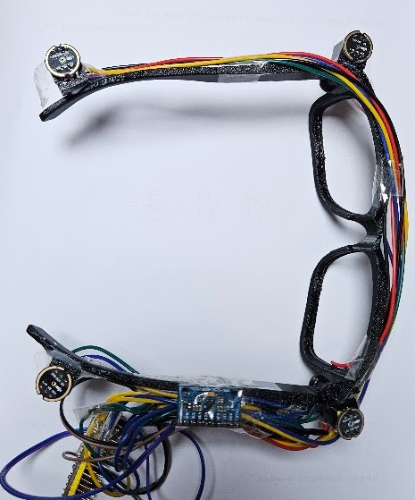

# HearSafe (구 DOA Sensor Node)

<p align="center"></p>

*안경 프레임 십자 배열 프로토타입 — 마이크 4개(INMP441)와 ESP32-S3 / Glasses-frame prototype: four INMP441 mics in a cross with the ESP32-S3.*

청각장애인 위험 소리 방향 감지 웨어러블. ESP32-S3와 INMP441 마이크 4개를 안경 프레임에
십자 배열로 장착해 소리 방향을 360° 추정(TDOA + GCC-PHAT)하고, IMU로 착용자가 고개를
돌려도 방향을 세계좌표로 유지하며, YAMNet으로 소리 종류(화재경보·경적·사이렌 등)를
분류해 방향과 함께 대시보드에 표시합니다. 배경·원리·실측 성과·개발 과정의 상세 기록은
[`docs/factsheet.md`](docs/factsheet.md)를 참고하세요.

2026년 7월에 개인 프로젝트로 혼자 개발했습니다. 아래 협업 규칙과 온보딩 자료는 이후 합류를 준비하던 팀원들을 위해 마련한 것입니다.

## 팀 협업

- 이슈/작업은 [GitHub Issues](../../issues), 진행 현황은 [Project 보드](../../projects)에서 트래킹합니다.
- 브랜치 전략·PR 규칙·역할별 작업 가이드는 [`CONTRIBUTING.md`](CONTRIBUTING.md)를 참고하세요.
- `main`은 보호 브랜치입니다. 항상 새 브랜치 + PR로 작업하세요 (직접 push 금지).

## 구성

- `src/main.cpp`: 48kHz 오디오 수집, 축별 TDOA(GCC-PHAT+온셋 정렬)와 2D 방위 계산, IMU(yaw) 융합, WiFi/USB 오디오·이벤트 스트리밍
- `include/pins.h`: I2S 핀, 마이크 간격, 축별 지연·게인 보정값, 장착 회전 보정
- `include/wifi_secrets.h.example`: WiFi 접속정보 템플릿 (`wifi_secrets.h`로 복사해 사용, 저장소에는 미포함)
- `dashboard/serve.py`: 시리얼(USB) 또는 WiFi(TCP)로 들어오는 이벤트를 여러 브라우저에 SSE로 중계, YAMNet 분류·커스텀 소리 지문 매칭 관리. `--record`/`--replay`로 세션 캡처·재생 지원(하드웨어 없이 실행 확인용)
- `dashboard/classifier.py`: YAMNet 기반 소리 분류 + 사용자 커스텀 소리 등록(few-shot 임베딩 매칭)
- `dashboard/doa-compass.html`: 대시보드 화면 (나침반/링/4방향 패널 3가지 뷰, 소리 등록 UI)
- `dashboard/tutorial_yamnet.ipynb`: 하드웨어 없이 소리 분류(YAMNet)만 랩탑으로 배우는 학습 노트북 (아래 참고)
- `대시보드시작.bat`: 무선(WiFi) 모드로 대시보드 서버를 바로 실행하는 단축 스크립트

## 빌드와 업로드

1. `include/wifi_secrets.h.example`을 같은 폴더에 `wifi_secrets.h`로 복사하고 실제 WiFi SSID/비밀번호를 입력합니다.
   (이 파일은 `.gitignore`에 등록되어 저장소에는 올라가지 않습니다. ESP32는 2.4GHz 대역만 지원합니다.)

```powershell
pio run
pio run --target upload
```

기본 업로드 포트는 `COM3`입니다. 실제 보드는 ESP32-S3-WROOM-1 N16R8로 설정되어
16MB 플래시와 8MB OPI PSRAM 구성을 사용합니다.

## 대시보드

```powershell
python -m pip install -r requirements.txt
python dashboard\serve.py --com COM3 --port 8765
```

`DOA_COM`, `DOA_BAUD`, `DOA_PORT` 환경변수로도 기본값을 지정할 수 있습니다.
서버가 출력한 PC 주소를 같은 네트워크의 태블릿이나 휴대폰에서 열면 됩니다.

### 무선(WiFi) 모드

기기가 WiFi에 연결되어 있으면(펌웨어 `ENABLE_WIFI 1`, 기본값) USB 없이도 동작합니다.

```powershell
python dashboard\serve.py --net doa-node.local
```

또는 `대시보드시작.bat`을 그대로 실행하면 됩니다. WiFi 연결이 끊기면 자동으로 USB
시리얼 경로로 폴백합니다. YAMNet 분류를 끄려면 `--no-classify` 옵션을 추가하세요
(최초 실행 시 YAMNet 모델을 인터넷에서 내려받아 캐시합니다).

### 재현(replay) 모드 — 하드웨어 없이 실행 확인

본 제품은 안경형 IoT 센서(ESP32+마이크 4개)가 있어야 방향 감지가 되는 임베디드
시스템이라, 실물 없이는 심사자가 직접 기기를 켤 수 없습니다. 이를 보완하기 위해
실제 기기로 수신한 세션을 그대로 저장했다가 재생하는 모드를 제공합니다 — 시뮬레이션이
아니라 **실제 하드웨어에서 캡처된 데이터**를 서버의 동일한 처리 경로(방향 판정 →
소리 분류 → 경보 융합 → 대시보드 SSE)로 다시 흘려보내는 방식입니다.

```powershell
# 기기 연결 상태에서 세션 캡처 (USB 또는 --net과 함께 사용)
python dashboard\serve.py --net doa-node.local --record demo_session.jsonl

# 하드웨어 없이 캡처된 세션 재생 (심사용)
python dashboard\serve.py --replay demo_session.jsonl
```

`--replay`는 `--com`/`--net` 대신 사용하며, 저장된 원본 이벤트를 캡처 당시와 같은
시간 간격으로 재생합니다. 브라우저에서 `http://localhost:8765`를 열면 실제 방향
화살표·소리 분류·경보가 그대로 재현됩니다.

### 하드웨어 없이 YAMNet만 배우기 (팀 온보딩용)

위 재현 모드가 "완성된 시스템을 심사자에게 보여주는" 용도라면, 이건 "아직 하드웨어가
없는 팀원이 소리 분류(YAMNet) 부분을 본인 랩탑만으로 직접 만져보며 이해하는" 용도입니다.

```powershell
python -m pip install -r requirements.txt
jupyter notebook dashboard/tutorial_yamnet.ipynb
```

테스트 사운드(`tools/`)나 랩탑 마이크 녹음으로 YAMNet 분류를 직접 돌려보고, 왜 그
소리로 판별됐는지(점수 근거), YAMNet이 내부적으로 파형을 어떻게 처리하는지(멜
스펙트로그램 시각화), 그리고 지금 이 프로젝트의 임계값·도메인 불일치 등 실제 튜닝
이슈를 어떻게 개선할지 순서대로 다룹니다.

## 캘리브레이션

1. `src/main.cpp`의 `DEBUG_FRAMES`를 잠시 `1`로 바꿉니다.
2. 배열 중앙선에서 여러 번 소리를 내고 축별 `lag` 평균을 구합니다.
3. 그 평균을 `include/pins.h`의 `LAG_OFFSET_X`, `LAG_OFFSET_Y`에 입력합니다.
4. 좌우 또는 상하가 반대로 표시되면 해당 `LAG_SIGN_*`의 부호를 바꿉니다.
5. 운영 시에는 시리얼 출력이 DMA 처리를 방해하지 않도록 `DEBUG_FRAMES`를 다시 `0`으로 둡니다.

펌웨어는 이벤트를 한 줄 JSON으로 출력합니다. `mode=2d` 레코드에는 `phi`, 축별
`lag`, 정규화 상관 피크, 신뢰도, 벡터 크기가 포함됩니다. 한 축만 검출되면 방위를
단정하지 않고 가능한 두 각도 후보를 출력합니다. 대시보드는 이전 텍스트 형식도
계속 읽을 수 있습니다.

## 오픈소스 사용 내역

- **YAMNet** (Google, [Apache License 2.0](https://github.com/tensorflow/models/blob/master/research/audioset/yamnet/LICENSE)) — AudioSet 521클래스로 사전학습된 오디오 분류 모델. `dashboard/classifier.py`에서 TensorFlow Hub를 통해 사용, 재학습 없이 그대로 활용하며 커스텀 소리 등록에는 임베딩 출력만 이용합니다.
